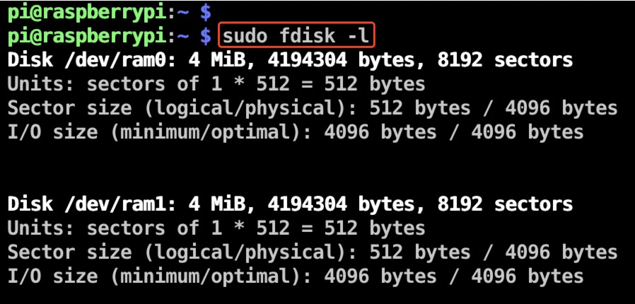
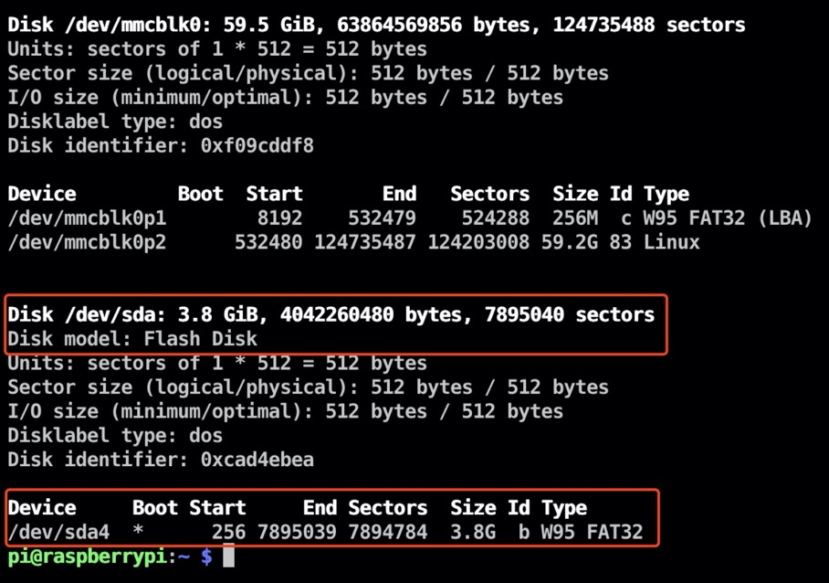
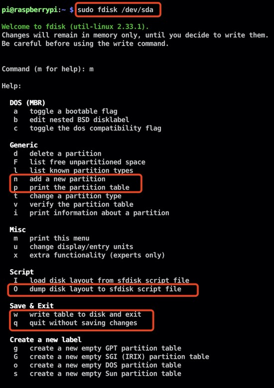
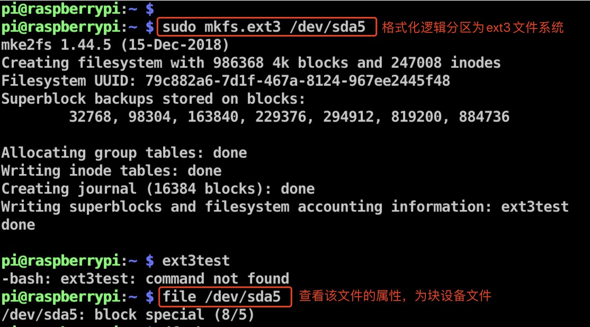
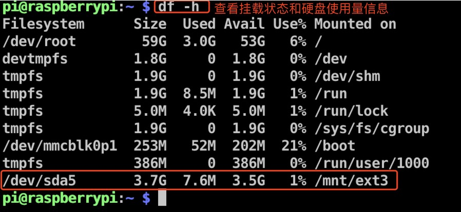

# 0B703-勇哥招亲组-综合应用实验

小组名称：勇哥招亲组  
小组成员：罗颖彪、杜嘉卓、赵勇

- [一、实验目的](#一、实验目的)
- [二、实验内容](#jump2)
- [三、实验过程与结果](#jump3)
- [四、实验总结](#jump4)
- [五、附实验源码](#jump5)

## 一、实验目的

能够综合应用课程所学的技术与工具，包括:

* Socket通信
* 多进程、多线程编程
* 交叉调试目标端程序
* 磁盘分区与文件系统创建
* 模块与驱动编程

## <span id="jump2">二、实验内容</span>

* 将树莓派设为智能家居Linux服务器，可用来采集并维护环境数据，如PM2.5、温度、湿度、气味、电器状态数据等。在实际环境中数据来自相应的传感器，本次试验中用scull设备模拟。有条件的小组鼓励使用真实设备采集数据;
* 要求创建2个以上的scull设备，设备驱动可选择从内核源码树外(Kbuild)编译安装，或加入到内核源码树内。驱动函数要求包括: open, release, read, write, llseek, ioctl;
* 实验中的环境数据存储在特定文件系统中。该文件系统要求具备属性:**在线写入、持久性、断电可靠性**;
* PC机、移动设备或另外一个树莓派用作远程客户端，随时请求获取环境数据，客户端和服务器之间采用Socket通信。
* APP编译采用交叉编译，用gdb-gdbserver交叉调试APP。

## <span id="jump3">三、实验过程与结果</span>

### 3.1 磁盘分区创建和文件系统挂载

#### 3.1.1 查看分区

在Linux系统中，管理硬盘设备最常用的方法是fdisk命令。fdisk命令用于管理磁盘分区，格式为"fdisk [磁盘名称]"，它提供了集添加、删除、转换分区等功能于一身的"一站式分区服务"。

插入U盘到树莓派的USB2.0接口，我们先用```sudo fdisk -l```查看当前硬盘分区情况：





可以观察到U盘被识别为设备文件/dev/sda，且只有一个拓展分区/dev/sda4。对物理设备命令的理解见附录：[常见硬件设备及其文件名称](#jump6)。

#### 3.1.2 使用fdisk增加分区

使用```sudo fdisk /dev/sda```进行分区。

fdisk命令中的参数以及作用：



创建拓展分区：


#### 3.1.3 格式化新分区并挂载





使用mount命令挂载的设备文件会在系统下一次重启时失效。如果想将文件系统为ext3的硬件设备/dev/sda5在开机后自动挂载到/mnt/ext3目录上，并保持默认权限且无需开机自检，就需要在/etc/fstab文件中写入下面的信息，这样在系统重启后也会成功挂载：


挂载信息写入到配置文件中：


填写格式：设备文件 挂载目录 格式类型 权限选项 自检 优先级（意义详见附录：[用于挂载信息的指定填写格式中，各字段所表示的意义](#jump7)）

## <span id="jump4">四、实验总结</span>

### 4.1 实验收获
✅掌握了

### 4.2 未解决问题
✅已解决：

## <span id="jump5">五、附实验源码</span>
✅见[code](./code)文件夹


**参考链接：**


**附录：**
1. <span id="jump6">常见硬件设备及其文件名称</span>

|硬件设备|文件名称|
| :---: | :--- |
|IDE设备|/dev/hd[a-d]|
|SCSI/SATA/U盘|/dev/sd[a-p]|
|软驱|/dev/fd[0-1]|
|打印机|/dev/lp[0-15]|
|光驱|/dev/cdrom|
|鼠标|/dev/mouse|
|磁带机|/dev/st0或/dev/ht0|

由于现在IDE设备已经比较少见，所以一般硬盘设备都会以"/dev/sd"开头。而一台主机上可以有多块硬盘，因此系统采用a~p来代表16块不同的硬盘（默认从a开始分配），而且硬盘的分区编号也很有讲究：
* 主分区或扩展分区的编号从1开始，到4结束；（可以将扩展分区理解为一个指向另一个分区的指针）
* 逻辑分区从编号5开始。

2. <span id="jump7">用于挂载信息的指定填写格式中，各字段所表示的意义</span>

|字段|意义|
| :---: | :--- |
|设备文件|一般为设备的路径+名称，也可以写唯一识别码(UUID, Universally Unique Identifier)|
|挂载目录|指定要挂载到的目录，需在挂载前创建好|
|格式类型|指定文件系统的格式，比如ext3、ext4、XFS、SWAP、iso9660(此为光盘设备)等|
|权限选项|若设置为defaults，则默认权限为：rw,suid,dev,exec,suto,nouser,async|
|自检|若为1则开机后进行磁盘自检，为0则不自检|
|优先级|若“自检”字段为1，则可对多块硬盘进行自检优先级设置|
